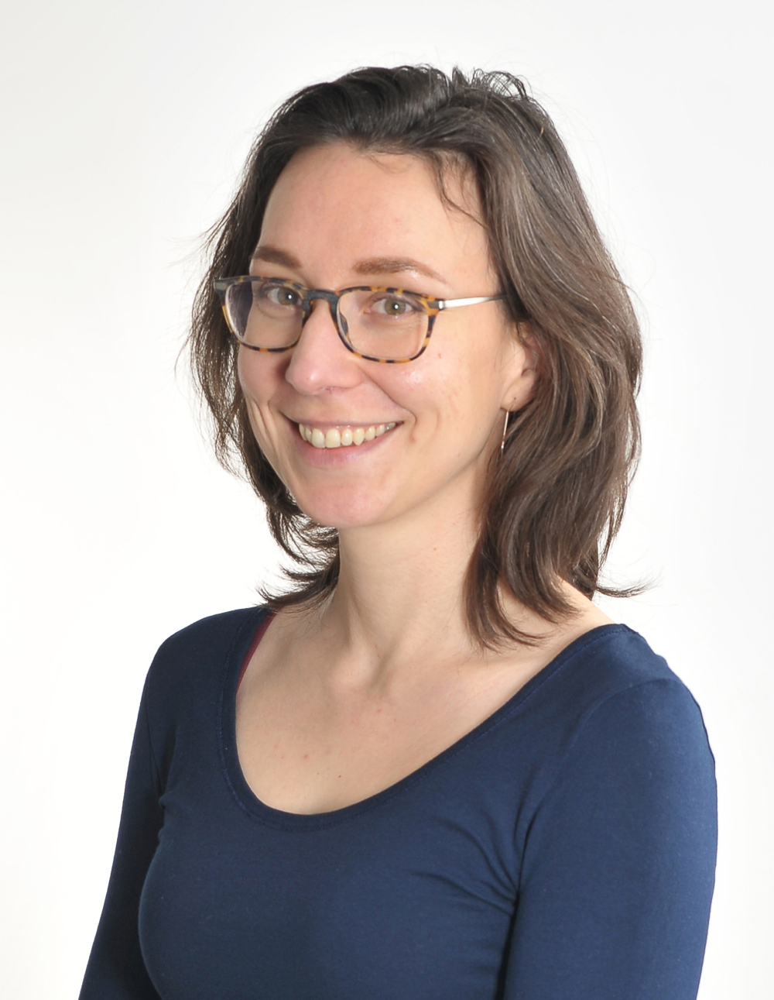

---
# Feel free to add content and custom Front Matter to this file.
# To modify the layout, see https://jekyllrb.com/docs/themes/#overriding-theme-defaults

layout: home
---

I am a postdoctoral researcher at GFZ Potsdam in Germany. As a geodynamicist, I use numerical models to understand plate boundary deformation. Divergent plate boundaries get my particular attention;
at the moment I am trying to pinpoint what geodynamic conditions make the formation of giant sediment-hosted metal deposits possible. The biggest source of lead and zinc, clastic-dominated mineral deposits in rifts and rifted margins are crucial for future societies and the energy transition. 

East African Rift System
------------------------
The EARS is the largest active continental rift on Earth. The plate boundary system is quite complex, with several large microplates that move independently from the surrounding major plates. In my <a href="https://do    i.org/10.1038/s41467-020-16176-x" target="target">2020 paper</a>, we showed that the rotation of the Victoria microplate is the result of the particular strength distribution of the lithosphere and the overall E-W extension. The combination of weak mobile belt orientation, overall E-W extension, microplate rotations and local sources of strength heterogeneity produces predominantly normal faulting even in the most oblique sections of the rift system. With regional spherical data-driven simulations, we now look at the contribution of mantle flow, plume impingement and lithospheric strength to deformation in the EARS. Zooming in on particular rifts in the system, I collaborated on rift linkage (<a href="https://www.nature.com/articles/s41467-019-09335-2" target="target">Corti et al. 2019</a>), deep crustal seismicity (<a href="https://doi.org/10.1029/2020GC008935" target="target">Muluneh et al. 2020</a>) and asymmetric rifting (<a href="https://doi.org/10.1029/2020tc006553" target="target">Richter et al. 2021</a>) in the Kenyan and Ethiopian rifts and upper mantle rheology beneath Madagascar (<a href="https://doi.org/10.1029/2019JB018560" target="target">Rajaonarison et al. 2020</a>).

Plasticity, elasticity and the earthquake cycle
-----------------------------------------------
Non-linear rheologies are of great importance when modeling the intricate processes of lithospheric and crustal deformation. In 2018, I published a <a href="https://www.solid-earth.net/9/267/2018/" target="target" >paper on plasticity</a> in the geodynamic modeling software ASPECT. In a current effort, we are implementing visco-elasto-viscoplastic rheologies both on advected compositional fields and on particles. With Esther Heckenbach, we are extending this rheology to include rate-and-state friction and dynamic timestepping, so that we can study the earthquake cycle.

Coupling between surface processes and lithosphere dynamics
-----------------------------------------------------------
Erosion and sedimentation redistribute the sediment load, which in turn affects the longevity of and displacment along faults in continental rifts. With Dr. Derek Neuharth we therefore two-way coupled the surface processes code FastScape to ASPECT. We studied the feedbacks between surface processes and lithosphere dynamics in several papers (e.g., <a href="https://doi.org/10.1029/2021TC007166" target="target">Neuharth et al. 2022a</a>, <a href="https://doi.org/10.1130/G49351.1" target="target">Neuharth et al. 2022b</a>). Currently, I'm looking at the types of sediments that are deposited in the rift basins (course- vs fine-grained, marine vs continental) and what scenarios are most favorable for metal deposit formation.
 
